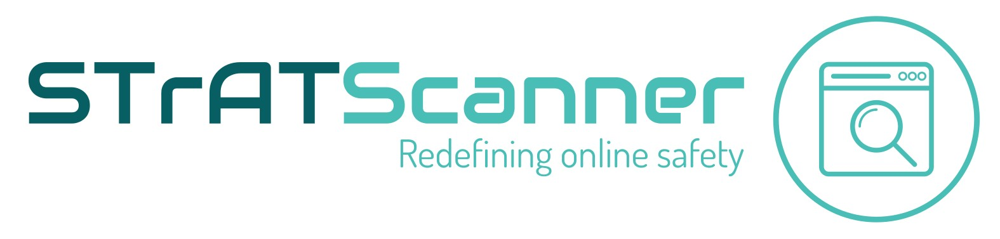

## Background and Motivation

I have always wanted to create a Site Reputability Scanner for a while now, hence the Site Triage and Analysis Tool (STrAT) was born.

For now you will need your own VirusTotal and Urlscan API keys, placed in a file in the directory which you clone this repo into, named `.env`.

### My Plan

_Subjected to changes_ as the project progresses

- [ ] **chore:** Scanning links provided by the user using both the Urlscan.io and VirusTotal APIs concurrently
    - [ ] user inputs still require validation 👀
    - [ ] addition of scan type feature (public, private or unlisted)
    - [x] removed potentially dangerous C2 callback by script -> used phishTank for now
    - [x] request timeout (async) for urlscan
    - [x] fix VT Url Analysis Report Output Issue; VT unscanned url returns `0` for `"malicious"` and `"harmless"` categories
    - [x] testing if script is working and cross-platform
    - [x] download URLScan Image
    - [x] add requirements.txt

- [ ] **additional features:** not entirely sure if feasible
    - [ ] Having the tool accept command line arguments and build help menu (probably using `argparse` or `getopts` python libraries?) 
    - [ ] Loading bar for API load 
    - [ ] Use some AI engine for heuristic scanning

- [ ] **chore:** Returning and determining results based on threat scoring (something like classifications on Hybrid Analysis)
- [ ] **chore:** Include and update [wiki](https://github.com/RyanNgCT/STrAT/wiki) for documentation

### Notes
- Feel free to create an issue for any suggestions or issues or use the PR functionality. 

## Requirements
- Python 3.8.x+
- See [requirements.txt](./requirements.txt) and install dependencies using:
```
$ pip install -r requirements.txt
```
- `.env` file layout (naming convention of the variables don't matter, but their order does -- as I hardcoded the index):
```
VT_API_KEY = '<VIRUSTOTAL_API_KEY>'
US_API_KEY = '<URLSCAN_API_KEY>'
```